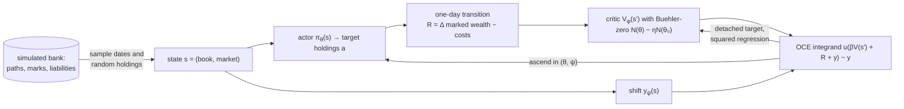
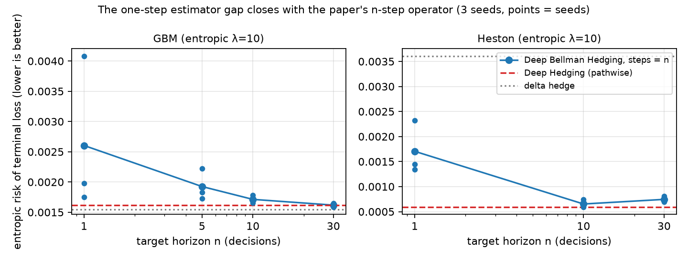

<h1 align="center">Deep Bellman Hedging</h1>

<p align="center">
Implementation, empirical study and Lean 4 formalisation of risk-averse dynamic programming for hedging —
the method of Buehler, Murray and Wood, <a href="https://arxiv.org/abs/2207.00932v4"><em>Deep Bellman Hedging</em></a>,
contributed to the <a href="https://github.com/0xC000005/hedging-gym">hedging-gym</a> research library.
</p>

<p align="center">
<a href="https://github.com/spirituslab/deep-bellman-hedging/actions/workflows/tests.yml"></a>
<a href="https://github.com/spirituslab/deep-bellman-hedging/actions/workflows/lean.yml"></a>
<a href="https://github.com/0xC000005/hedging-gym/pull/2"></a>
<a href="https://github.com/0xC000005/hedging-gym/pull/3"></a>
<a href="formal/README.md"></a>
<a href="pyproject.toml"></a>
<a href="https://github.com/spirituslab/deep-bellman-hedging/releases"></a>
<a href="LICENSE"></a>
</p>

**Abstract.** Deep Hedging learns a hedging policy for one fixed book by differentiating a terminal risk
measure through a simulated episode. Deep Bellman Hedging (DBH) replaces the episode by a Bellman
recursion over states (book, market) in which the expectation is a *monetary utility*, so that one
actor–critic pair hedges and prices arbitrary books. This repository implements DBH as a baseline of
hedging-gym (actor–critic value iteration with optimized-certainty-equivalent utilities, an entropic
terminal objective for like-for-like comparison, a qualification runner and 42 numeric-invariant tests),
measures it against pathwise Deep Hedging and the delta hedge over three seeds, and formalises the
paper's fixed-point theory in Lean 4 with mathlib. Empirically the published one-step estimator trails
Deep Hedging by 2–3× under proportional costs while beating it without costs; the paper's own $n$-step
operator closes the gap, and the diagnosis matches the training recipe of the authors' numerical
companion. Both contributions were reviewed and merged by the library's maintainer.

- **Merged upstream** after a technical review: [PR #2](https://github.com/0xC000005/hedging-gym/pull/2)
  (Python, commit `15a562e`) and [PR #3](https://github.com/0xC000005/hedging-gym/pull/3) (Lean, commit `a475769`).
- **Formalised**: every fixed-point result of the paper — Theorem 1, value-iteration convergence, the
  finite-horizon case, the vanilla Deep Hedging equation, the OCE lemma, the critic-loss identity, the
  statistical-arbitrage bound — in [`formal/`](formal/README.md); no `sorry`, no added axioms.
- **Measured**: a 3-seed study on Heston, GBM and the Bühler task with a clear result and a mechanism
  behind it ([§6](#6-empirical-study)).
- **Reproducible**: locked environment, cached banks, reload and ledger reconciliation on every run,
  [release](https://github.com/spirituslab/deep-bellman-hedging/releases/tag/dbh-study-2026-09-13) of the
  compact artifacts, CI for the Python suite and the Lean build.

**Contents**
[1 What is mine](#1-what-is-in-this-repository-and-what-is-mine) ·
[2 Background](#2-background-from-deep-hedging-to-deep-bellman-hedging) ·
[3 Mathematics](#3-the-mathematics) ·
[4 Lean](#4-formalisation-in-lean-4) ·
[5 Implementation](#5-implementation) ·
[6 Study](#6-empirical-study) ·
[7 Reproduce](#7-reproduce) ·
[8 Host library](#8-the-host-library) ·
[9 Author](#9-author-and-citation)

## 1. What is in this repository, and what is mine

This is a fork of hedging-gym; `main` tracks upstream. The Deep Bellman Hedging work consists of two
squash-merged commits, listed below; everything else in the tree is the host library by its maintainer.

| Contribution | Upstream commit | Files |
|---|---|---|
| Deep Bellman Hedging baseline, entropic objective, runner, tests, docs | [`15a562e`](https://github.com/0xC000005/hedging-gym/commit/15a562e) (PR #2, 14 files, +1 159 lines) | [`baselines/deep_bellman_hedging.py`](src/hedging_gym/baselines/deep_bellman_hedging.py), [`benchmarks/qualify_deep_bellman.py`](benchmarks/qualify_deep_bellman.py), [`tests/test_deep_bellman_hedging.py`](tests/test_deep_bellman_hedging.py), `RiskConfig` in [`environment/config.py`](src/hedging_gym/environment/config.py), [`evaluation.py`](src/hedging_gym/evaluation.py), `docs/` |
| Lean 4 formalisation | [`a475769`](https://github.com/0xC000005/hedging-gym/commit/a475769) (PR #3, 14 files, +930 lines) | [`formal/`](formal/) — 8 modules, README with the theorem map |
| Study record (this fork only) | — | this README, [`docs/figures/`](docs/figures/), the CI workflows, the release with the artifacts, the development branches `deep-bellman-hedging` and `deep-bellman-formal` |

## 2. Background: from Deep Hedging to Deep Bellman Hedging

**Hedging as sequential decision-making.** A trader holds a book $z$ of derivatives and, on each of
$N$ daily decisions, chooses holdings $a$ of liquid hedging instruments $h$ under transaction costs and
position limits. The terminal profit and loss is random; the trader is risk-averse, so the quality of a
policy is a risk measure of that terminal loss, not its mean.

**Deep Hedging** ([Bühler, Gonon, Teichmann, Wood 2019](https://arxiv.org/abs/1802.03042)) parameterises
the policy by a neural network, simulates whole episodes, and minimises the terminal risk measure by
backpropagating through every trade — a Monte-Carlo, actor-only, *pathwise* policy gradient (the
critic-free end of the stochastic-value-gradient family). It is trained for one initial book, one horizon
and one risk aversion; a new trade, a changed book or a changed risk appetite means a new model.

**Deep Bellman Hedging** ([Buehler, Murray, Wood 2022](https://arxiv.org/abs/2207.00932v4)) reformulates
the problem as dynamic programming on the state $s = (z, m)$ of book and market. The value function
$V(z, m)$ is the risk-adjusted *excess* of the book over its book value and satisfies a Bellman equation
whose expectation is replaced by a monetary utility $U$. Three things follow. One actor–critic pair
covers every book in the feature space, because books are states rather than training targets. The
critic is an *indifference price*, because monetary utilities are cash-invariant — the same model prices
and hedges. And the whole construction is well-posed: for monotone, cash-invariant utilities the Bellman
operator is a contraction, so the value function exists, is unique and is reached by value iteration —
the theory this repository formalises.

| | Deep Hedging | Deep Bellman Hedging |
|---|---|---|
| Objective | terminal risk measure of one episode | nested one-step monetary utility (equal to the terminal objective only for the entropic utility and the mean) |
| Learning signal | pathwise gradient of the terminal loss through all $N$ decisions | one-step target $U[\beta V(s') + R]$ bootstrapped from a learned critic (SVG(1), DDPG-like) |
| Training states | one initial book, dates visited by the policy | books and dates sampled from a distribution $Q$ over states |
| Reward | none until settlement | daily change of marked wealth minus costs; the rewards telescope to the same terminal P&L |
| Outputs | a hedge | a hedge and a value (price) |
| A new trade | retrain | evaluate |
| Reinforcement-learning analogue | Monte-Carlo policy gradient, SVG($\infty$) | actor–critic value iteration, SVG(1) |

The last two rows are where the empirical story of [§6](#6-empirical-study) lives: a one-step target
carries one day of variance against one day of noise, so the credit assignment that Deep Hedging gets
for free from backpropagation through 30 days has to be recovered by the critic — and with the paper's
$n$-step operator at $n = 30$ the two methods coincide.

## 3. The mathematics

The statements below follow revision 2.03 of the paper (arXiv v4); numbers refer to it. Each is linked
to its Lean declaration in [§4](#4-formalisation-in-lean-4).

**Monetary utilities and optimized certainty equivalents.** An operator $U$ on outcomes is a *monetary
utility* if it is monotone ($X \le Y \Rightarrow U[X] \le U[Y]$) and cash-invariant
($U[X + c] = U[X] + c$). The *optimized certainty equivalent* (OCE) of a concave increasing $u$ with
$u(0) = 0$, $u'(0) = 1$ (Definition 2) is

$$U[X] = \sup_{y \in \mathbb{R}} \; \mathbb{E}\big[u(X + y)\big] - y ,$$

and it is a monetary utility: monotone because $u$ is, cash-invariant by the substitution
$y \mapsto y - c$. The entropic utility $u(x) = (1 - e^{-\lambda x})/\lambda$ gives
$U[X] = -\tfrac{1}{\lambda}\log \mathbb{E}[e^{-\lambda X}]$; the CVaR utility
$u(x) = (1 + \lambda)\min(x, 0)$ gives minus the expected shortfall at level $\alpha = \lambda/(1+\lambda)$.

**The Bellman equation** (Definition 1, equation (3)). With $z'$ the book carried to tomorrow, $h'$ the
hedging instruments tomorrow, $M'$ tomorrow's market and $R$ the one-step reward,

$$(Tf)(z, m) = \sup_{a \in \mathcal{A}(z, m)} \; U\Big[\, \beta(m)\, f\big(z' + a \cdot h',\, M'\big) + R(a; z, m, M') \;\Big|\; m \Big], \qquad V^* = T V^* .$$

**Theorem 1 (existence and uniqueness).** If rewards are finite (equation (4)) and
$\beta^* = \sup_m \beta(m) < 1$, the equation has a unique bounded solution, and value iteration
$V^{(n)} = T V^{(n-1)}$ converges to it from any bounded start.

<details>
<summary>Proof sketch (the argument formalised in <code>Contraction.lean</code> and <code>Bellman.lean</code>)</summary>

Monotonicity of $U$ makes $T$ monotone: $f \le g \Rightarrow Tf \le Tg$. Cash-invariance pulls constants
out with the discount: $T(f + c) \le Tf + \beta^* c$ for $c \ge 0$. Since $f \le g + \lVert f - g \rVert$,

$$Tf \;\le\; T\big(g + \lVert f - g\rVert\big) \;\le\; Tg + \beta^* \lVert f - g \rVert ,$$

and symmetrically, so $\lVert Tf - Tg \rVert \le \beta^* \lVert f - g \rVert$: $T$ is a
$\beta^*$-contraction in the supremum norm. Finite rewards bound $T0$, so $T$ maps bounded functions to
bounded functions, and Banach's fixed-point theorem gives the unique solution and the geometric
convergence of value iteration.
</details>

**Zero rates.** The benchmark enforces $r = q = 0$, so $\beta \equiv 1$ and the contraction argument is
unavailable. With a fixed maturity the continuation is masked from maturity on, $T^{N+1}$ no longer
depends on its argument, and backward induction gives the unique solution without a contraction
(`FiniteHorizon.lean`).

**Time consistency** (Theorem 2, not formalised). The nested recursion equals the terminal
(Deep Hedging) objective if and only if $U$ is time-consistent, which among OCEs means the entropic
utility or the mean. For CVaR the nested composition is a *different* objective from terminal expected
shortfall — in the study the nested critic's value is 50–200× the terminal ES. This is why the entropic
objective was added to the library: it is the one objective under which nested and pathwise training
can be compared like for like.

**Book value and multi-step targets** (Remarks 1 and 2). Rewriting the value as $\tilde V = V + B$ with
$B$ the book value turns the recursion into one on cash flows (equation (6)); learning the excess over
book value is easier because cash flows are rare. The $n$-step operator $T_n$ applies one utility to $n$
discounted rewards plus the continuation (equation (7)); its fixed point differs from $V^*$ unless the
utility is time-consistent *and* undiscounted — with a discount factor inside the utility the risk
aversion is rescaled, as a two-step example shows. In the implementation `steps=n` is $T_n$; at $\beta = 1$
with the entropic utility it is exactly the $n$-fold iterate.

**Critic loss and statistical arbitrage.** The nested squared loss
$\mathbb{E}\big[(V(S) + \mathbb{E}[h(S') \mid S] + g(S))^2\big]$ and the unconditional loss
$\mathbb{E}\big[(V(S) + h(S') + g(S))^2\big]$ have the same gradient in $V$ (tower property, footnote 14),
which licenses regressing the critic on single next-state samples. If the market admits only finite
statistical arbitrage, the utility of any policy's gains is bounded (footnote 16), which is the
finite-reward hypothesis; in a market without statistical arbitrage the value of a book at its book
value is zero — the risk-neutral check in the study.

## 4. Formalisation in Lean 4

`formal/` is a Lake project (Lean 4.33.1, mathlib v4.33.1). Value functions live in the bounded functions
`S →ᵇ ℝ` with the supremum norm; a monetary utility is an abstract operator indexed by today's state, and
`OCE.lean` works on a finite sample space matching the paper's finite training sample.

| Paper | Lean | Status |
|---|---|---|
| §2.1 monetary utility | `MonetaryUtility` | formalised |
| §5 contraction from monotonicity and cash-subinvariance; Banach; value iteration | `contractingWith_of_monotone_cash`, `existsUnique_fixedPoint_of_monotone_cash`, `tendsto_iterate_of_monotone_cash` | formalised |
| Theorem 1 | `HedgingModel.existsUnique_value`, `tendsto_iterate_value` | formalised |
| Finite horizon at $\beta = 1$ | `existsUnique_fixedPoint_of_horizon`, `HedgingModel.existsUnique_value_of_horizon` | formalised (beyond the paper) |
| Equation (18), Theorem 3: vanilla Deep Hedging equation | `VanillaModel.bellman`, `VanillaModel.existsUnique_value` | formalised |
| Definition 2: OCEs are monetary utilities; entropic and CVaR instances | `FiniteLaw.toMonetaryUtility`, `entropicUtility_*`, `cvarUtility_*` | formalised |
| Footnote 14: unconditional versus nested critic loss | `JointLaw.unconditional_eq_nested_add` | formalised |
| Footnote 16: finite statistical arbitrage bounds gains | `utility_gains_le_of_finite_arbitrage` | formalised |
| Theorem 2: time consistency | — | not formalised |
| Remark 2: multi-step operator $T_n$ | — | not formalised |
| Convergence of the neural training | — | outside the paper's claims |

Two modelling choices are stronger than the paper's text and are stated in
[`formal/README.md`](formal/README.md): the finite-reward hypothesis is taken uniformly over states (the
supremum-norm argument needs $T0$ bounded), and the state space carries the discrete topology. The
maintainer's review of the sources: *"no mathematical contradiction in the inspected theorem
statements/proofs, and no `sorry`, added axioms or proof-admission shortcuts."* The
[Lean build](https://github.com/spirituslab/deep-bellman-hedging/actions/workflows/lean.yml) runs in CI.

## 5. Implementation



- **Rewards** are one-step changes of marked wealth from the shared ledger; they telescope to the
  ledger's terminal P&L in every settlement mode (a test checks this), so the value is the excess over
  book value and starts and settles at exactly zero.
- **Utilities**: entropic, CVaR, truncated entropy, Vicky, quadratic and identity, written in
  cancellation-free forms with $u(0) = 0$ exactly in float32; the learned OCE shift $y_\psi$ is trained
  jointly with the actor.
- **Buehler-zero critic** $N(\theta; x) = \mathcal{N}(\theta; x) - \eta\,\mathcal{N}(\theta_0; x)$ so that
  $V^{(0)} \equiv 0$ without zero weights.
- **Books** are random holdings on simulated paths (the paper tabulates history); one trained model
  covers arbitrary initial books, which the runner evaluates without retraining.
- **Estimator options** beyond the published `steps=1, scenarios=1, aggregate="oce"`: `steps=n`
  (the paper's $T_n$ with pathwise gradients through $n$ decisions), `scenarios=K` (fresh conditional
  continuations instead of the bank's next day), `aggregate="entropic"` (closed-form certainty
  equivalent over scenarios — a logarithm of a finite sample mean, hence biased at fixed $K$).
- **Units**: learner quantities are expressed in one-day stock moves $S_0\sqrt{v\,\Delta t}$, which is
  equivalent to rescaling the risk aversion; gradients are norm-clipped. Reported values are money.
- **Disclosed differences** from the paper (module docstring): reward inside the utility as in
  Definition 1; unconditional critic loss; cash is not a network input (cash-invariance); closeout fee
  inside the final reward; simulated rather than tabulated books.
- **Tests** (`tests/test_deep_bellman_hedging.py`, 42 with `test_config.py`): utilities normalised,
  monotone, concave; OCE shifts equal the negative `RiskConfig` losses; rewards telescope in every
  settlement mode; transitions reproduce the environment's observations; actor gradient matches finite
  differences; the critic starts at exactly zero; multi-step targets settle early exactly; scenarios are
  reproducible; entropic aggregate equals the OCE supremum; split training resumes bit-exactly on CPU
  and CUDA; zero initial variance handled.

## 6. Empirical study

**Setup.** hedging-gym's default task: Heston market, 30 daily decisions, a short at-the-money call
hedged with the stock and a longer-dated call, proportional costs and holding limits; a GBM variant of the
same task; and the Bühler Heston task (frictionless, unbounded). Objective: entropic risk with
$\lambda = 10$ (and ES95 for the CVaR utility). 5 000 updates of batch 32 per seed, seeds 7, 8, 9, fresh
paired evaluation paths; every run reloads its saved policy and reconciles the executed ledger
independently. Compute is reported as sampled transitions.

<p align="center"></p>

| Task / objective | DBH | Deep Hedging | Delta |
|---|---|---|---|
| Heston, entropic $\lambda = 10$, published scheme | 0.00171 ± 0.00054 | 0.00060 ± 0.00002 | 0.00361 |
| same, DBH matched to Deep Hedging's sampled transitions | 0.00141 ± 0.00018 | — | — |
| same, `steps=10` / `steps=30` | 0.00065 ± 0.00008 / 0.00075 ± 0.00006 | 0.00060 | 0.00361 |
| GBM, entropic $\lambda = 10$, `steps=1/5/10/30` | 0.00260 ± 0.00129 / 0.00193 ± 0.00027 / 0.00171 ± 0.00007 / 0.00162 ± 0.00003 | 0.00162 ± 0.00009 | 0.00154 |
| GBM, `scenarios=8` / `32` / `32, aggregate="entropic"` | 0.00199 ± 0.00036 / 0.00273 ± 0.00104 / 0.00207 ± 0.00024 | — | — |
| Heston ES95, CVaR utility | 0.026 ± 0.029 (one seed diverged) | 0.00426 ± 0.00001 | 0.0613 |
| Bühler task, ES50 | 0.837 ± 0.009 | 0.955 ± 0.038 | — |

**Findings.**

1. DBH beats the delta hedge on the Heston tasks and pathwise Deep Hedging on the frictionless Bühler
   task; on the GBM task the delta hedge is best. With the risk-neutral utility the critic's initial
   value is $\approx 0$, as the theory predicts for a book at its book value.
2. Under proportional costs the published one-step estimator stays 2–3× behind Deep Hedging at every
   budget tried, and the paper's own $n$-step operator closes the gap: on Heston `steps=10` reaches
   0.00065 against 0.00060; on GBM the sweep converges to Deep Hedging at $n = 30$, where the
   target *is* the pathwise objective.
3. The mechanism, from three diagnostics on deployed states: the per-sample actor-gradient
   signal-to-noise ratio is 0.02–0.07; the critic is 7–9× too pessimistic in level and its derivative in
   holdings agrees in sign with a Monte-Carlo finite difference no better than chance; the policy is
   greedy *on average* (critic-implied and true objectives peak at its mean action) but scattered per
   state (≈ 0.07 stock) and trades twice as much; the deficit against Deep Hedging grows linearly with
   the remaining horizon. More conditional scenarios, more critic steps, a wider network or 30× longer
   training do not change this.
4. This is consistent with the authors' numerical companion
   ([Murray, Wood, Buehler, Wiese, Pakkanen, ICAIF 2022](https://arxiv.org/abs/2207.07467)), which
   reproduces vanilla Deep Hedging only with a Polyak target critic, an actor skip connection over the
   Black–Scholes delta, a critic residual over the book value, on-policy episodes, exponential-form
   losses and a very large budget — none of which the theory paper's scheme contains. Those ingredients
   are the next experiment; the estimator variants, their invariants and a measurement protocol are laid
   out in the follow-up section of [PR #2](https://github.com/0xC000005/hedging-gym/pull/2).
5. Two caveats the study keeps: under the CVaR utility the critic represents the nested utility, not
   the evaluator's terminal expected shortfall, so value checks are only comparable under the entropic
   utility; and the matched run matches 38.4 M sampled transitions, while DBH evaluates each pair for
   the actor and for the critic, so it is not a claim of identical compute.

## 7. Reproduce

```bash
git clone https://github.com/spirituslab/deep-bellman-hedging.git && cd deep-bellman-hedging
uv sync --locked
uv run --frozen pytest tests/test_deep_bellman_hedging.py tests/test_config.py -q   # 42 tests, ~10 s
uv run --frozen python benchmarks/qualify_deep_bellman.py --objective entropy --risk-aversion 10 \
  --updates 100 --train-paths 1024 --eval-paths 2048 --seeds 7 --compare-dh \
  --device cuda --bank-dir /tmp/dbh-banks --output-dir /tmp/dbh-smoke   # ~6 min, mostly bank generation
cd formal && lake exe cache get && lake build                                        # Lean proofs
```

The full study — task configurations, launch scripts, the 23 `result.json` files, summary tables,
diagnostic scripts and a reproduction README — is the release asset
[`dbh-study-2026-09-13.zip`](https://github.com/spirituslab/deep-bellman-hedging/releases/tag/dbh-study-2026-09-13);
`python3 summarize.py` inside it regenerates every table, and `docs/figures/dbh-horizon-sweep.png` is drawn
from the same files. Trade tapes and checkpoints (~800 MB) are available on request. The CI workflows in
[`.github/workflows`](.github/workflows) run the full Python suite with `hedging_gym.validate`, and the Lean
build with the mathlib cache.

## 8. The host library

[hedging-gym](https://github.com/0xC000005/hedging-gym) is a research library for option hedging: a
configurable financial environment (GBM, Heston and Bates markets, configurable instruments and execution,
Gymnasium and PyTorch interfaces), classical and learned baselines that share one market simulation,
observation schema, legal-trade set, cash ledger and terminal-loss evaluation, and paper benchmark
configurations. Its own guides: [getting started](docs/getting-started.md), the
[baseline catalogue](docs/baselines.md), [paper benchmarks](docs/paper-benchmarks.md),
[benchmark equations](docs/benchmark.md), [validation](docs/validation.md),
[related work](docs/related-work.md) and [contributing](CONTRIBUTING.md).

```text
src/hedging_gym/
  environment/       financial core, stepping, episodes and simulated branches
  baselines/         one named module per method — deep_bellman_hedging.py is the contribution
    _shared/         reused learner mechanics
  evaluation.py      common controller evaluation
benchmarks/          runnable comparisons; qualify_deep_bellman.py is the study runner
tests/               financial, API and baseline checks
docs/                usage, sources, validation; figures/ holds the study figure
formal/              the Lean 4 formalisation
```

## 9. Author and citation

Andy Wang ([@spirituslab](https://github.com/spirituslab)). The work is the basis of a master's thesis on
risk-averse reinforcement learning for hedging. Cite the repository with the metadata in
[`CITATION.cff`](CITATION.cff) (GitHub's *Cite this repository* button), and the method as Buehler, Murray
and Wood, *Deep Bellman Hedging*, arXiv:2207.00932.

## License

Original code and documentation use the [MIT License](LICENSE); incorporated third-party code retains its
own license, see [Third-party notices](THIRD_PARTY_NOTICES.md).
